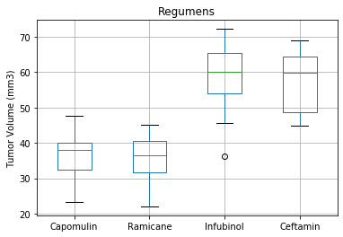
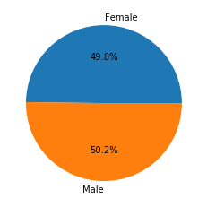
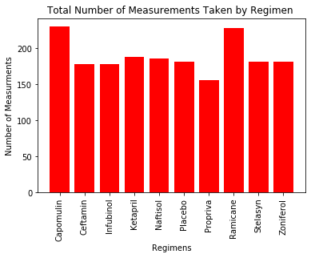
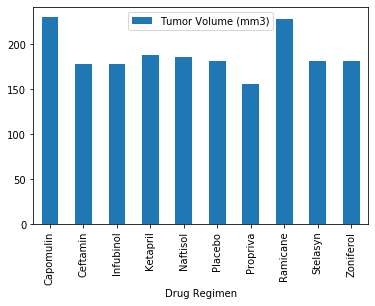
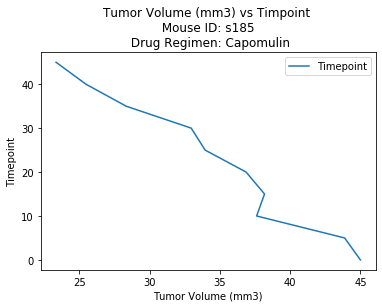
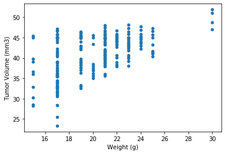
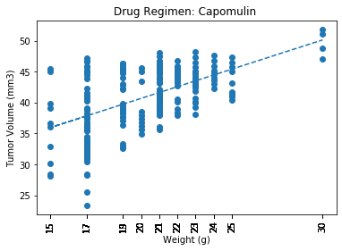

# Matplotlib-challenge

While your data companions rushed off to jobs in finance and government, you remained adamant that science was the way for you. Staying true to your mission, you've joined Pymaceuticals Inc., a burgeoning pharmaceutical company based out of San Diego. Pymaceuticals specializes in anti-cancer pharmaceuticals. In its most recent efforts, it began screening for potential treatments for squamous cell carcinoma (SCC), a commonly occurring form of skin cancer.

As a senior data analyst at the company, you've been given access to the complete data from their most recent animal study. In this study, 249 mice identified with SCC tumor growth were treated through a variety of drug regimens. Over the course of 45 days, tumor development was observed and measured. The purpose of this study was to compare the performance of Pymaceuticals' drug of interest, Capomulin, versus the other treatment regimens. You have been tasked by the executive team to generate all of the tables and figures needed for the technical report of the study. The executive team also has asked for a top-level summary of the study results.

Process and workflow of the analysis for this Project

1.	Extract the Data from the files “Mouse_metadata.csv” and “Study_results.csv”
2.	Do an inner merge on the column “Mouse ID” of both files and create a single Data Frame
3.	Remove the duplicated ID
4.	Create the summary Statistics of the whole data
    - Mean
    - Median
    - Variance
    - Standard deviation
    - Standard error of the mean
    - 
5. Some General observations of the Data
    

    

    

6.	As an example, it was chosen to do an analysis the mouse with the ID: s185 and the Drug Regimen Capomulin
7.	For this, it was created the following plots
    - Linear Plot of Tumor Volume (mm3) vs Timepoint

    
    - Scatter Plot of Tumor Volume vs Weight

